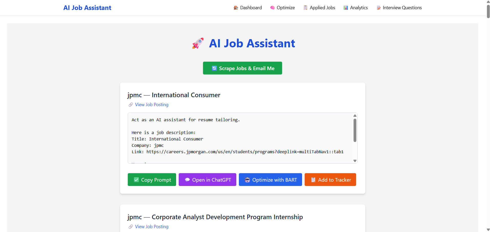
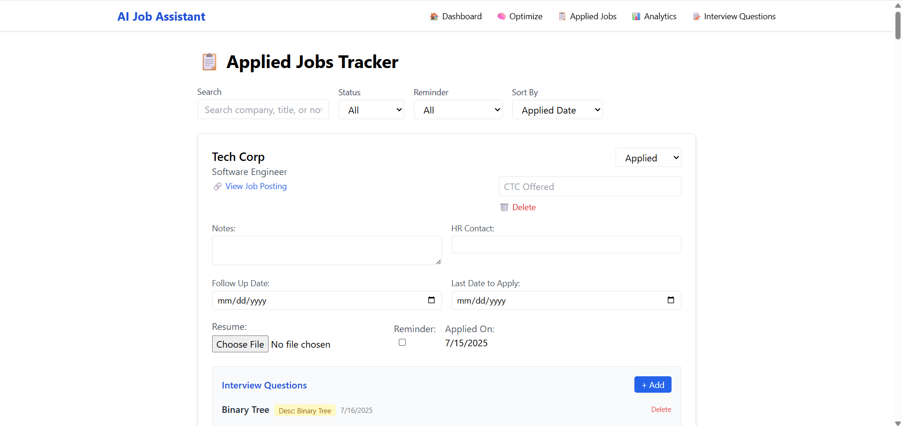
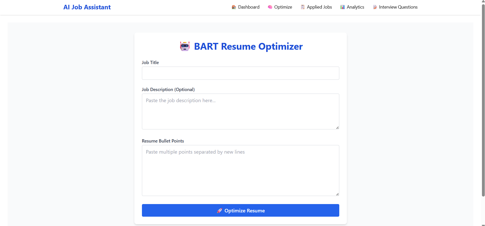
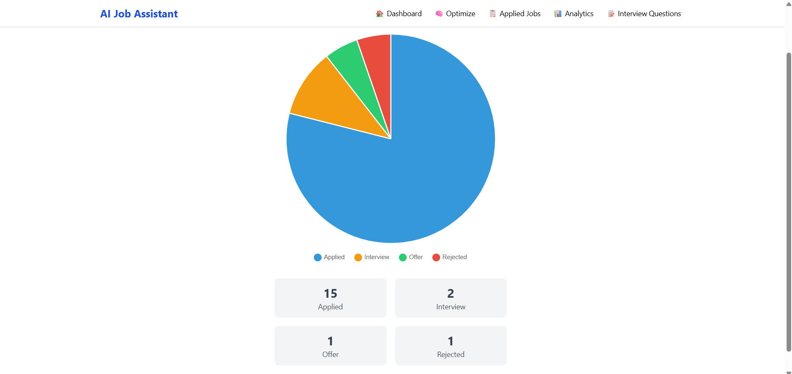
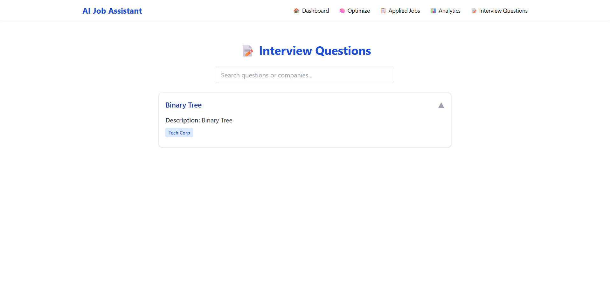

# 💼 Job Automation Platform

A powerful, AI-enhanced job application manager that **automates job scraping**, **tracks applications**, **sends email reminders**, and **optimizes your resume with BART/ChatGPT**.
All with a clean and modern UI, built for efficiency.

---

## 🚀 Features at a Glance

### 🧠 AI Resume Optimization

* Tailored bullet points using **BART/ChatGPT**
* One-click prompts for editing in ChatGPT

### 🔍 Job Scraping & Alerts

* Manual and automated scraping from company sites & job boards
* Scheduled scraping (twice daily: 11:00 AM & 4:00 PM)
* Email delivery of job results

### 📋 Job Tracker

* Track application status: Applied, Interview, Rejected, Offer
* Upload resumes, add notes, HR contacts, and deadlines
* Follow-up reminders

### 📧 Email Notifications

* Curated job match alerts
* Deadline and follow-up email reminders

### 🎤 Interview Questions Manager

* Add, group, and manage unique interview questions
* Company badges and collapsible UI for better UX

### 📊 Analytics Dashboard

* Visual charts and stats using Chart.js
* Overview of application progress

### 💻 Modern UI/UX

* Responsive React + Tailwind CSS frontend
* Search, filter, and navigate effortlessly

---

## 🛠️ Tech Stack

| Area       | Tech Used                           |
| ---------- | ----------------------------------- |
| Frontend   | React, Tailwind CSS                 |
| Backend    | Flask (Python)                      |
| Database   | SQLite                              |
| Automation | Python scripts (scraping & email)   |
| Analytics  | Chart.js                            |
| Email      | SMTP (Gmail integration)            |
| Config     | dotenv for secure environment setup |

---

## 🚦 Local Development Setup

### 1. Clone the Repository

```bash
git clone https://github.com/yourusername/job-automation.git
cd job-automation
```

### 2. Backend Setup

```bash
cd backend
python -m venv venv

# On Windows
venv\\Scripts\\activate

# On Mac/Linux
source venv/bin/activate

pip install -r ../requirements.txt

# Ensure backend/.env is configured
python server/bart_server.py
```

### 3. Frontend Setup

```bash
cd ../frontend
npm install

# Ensure frontend/.env is configured
npm start
```

---

## 🔐 Environment Variables

### backend/.env

```
FRONTEND_URL=http://localhost:3000
BART_PUBLIC_URL=http://localhost:5002
CLEARBIT_LOGO_API=https://logo.clearbit.com
SMTP_HOST=smtp.gmail.com
SMTP_PORT=587
SMTP_USER=your_email@gmail.com
SMTP_PASS=your_app_password
TO_EMAIL=your_email@gmail.com
```

### frontend/.env

```
REACT_APP_API_URL=http://localhost:5002
CLEARBIT_LOGO_API=https://logo.clearbit.com
```

📌 **Note:** Use a Gmail App Password if 2FA is enabled.

---

## 🧩 Project Structure

```
Job Automation/
├── backend/
│   ├── database/
│   ├── email/
│   ├── resume/
│   ├── scraper/
│   ├── server/
│   ├── uploads/
│   └── utils/
└── frontend/
    ├── public/
    └── src/
        ├── components/
        └── pages/
```

---

## 📸 Screenshots
📊 Dashboard

📁 Tracker

📄 Resume Optimizer

📊 Analytics

🎤 Questions


---

## 🤝 Contributing

Pull requests are welcome!
For major changes, please open an issue first to discuss what you would like to change.

---

## 🛡️ License

This project is licensed under the [MIT License](LICENSE).

---

## ⭐ Credits

* [OpenAI](https://openai.com/) – for AI resume suggestions
* [Clearbit](https://clearbit.com) – for company logos
* [BART](https://huggingface.co/facebook/bart-large)

---

## 🌟 Show Your Support

If you found this project helpful, please ⭐ star the repository and share it with others!

## Ethical Use Policy

This project is designed with the highest standards of ethical and legal compliance for web scraping. By using this project, you agree to the following:

- **robots.txt Compliance:** The scraper checks and respects each site's robots.txt, including Disallow and Crawl-delay directives. If scraping is disallowed, the site is skipped.
- **User-Agent Disclosure:** All requests use a clear, honest User-Agent string identifying this bot and providing contact information.
- **Delays:** There is a random delay (3–5 seconds) between each job listing/page and a random or crawl-delay (8–15 seconds or as specified) between companies.
- **Daily Cap:** No more than 100 companies are scraped per 24 hours, regardless of uploads or sessions.
- **Upload Limits:** Only 20 companies per Excel upload, and only one upload per hour.
- **Logging:** All requests, errors, and scraping activity are logged for transparency and review.
- **Captcha Detection:** If a captcha or anti-bot challenge is detected, scraping for that company stops immediately.
- **Automatic Pause:** If a 429/403/503 error is detected, all scraping is paused for 6 hours to avoid further issues.
- **No Bypassing Protections:** The project does not use proxies, VPNs, or any method to bypass anti-bot measures or authentication.
- **Data Deletion on Request:** Any company or site owner may request deletion of their data by contacting the maintainer. All job records and logs for that company will be deleted promptly.
- **Log Monitoring:** The maintainer is responsible for regularly monitoring logs for errors or complaints and responding promptly.
- **No Commercial Use:** This project is for personal, research, or educational use only. Do not use scraped data for commercial purposes without explicit permission from the data owner.

If you are a site owner and wish to have your data removed, or have any concerns, please contact the maintainer at [your-email@example.com].

**By using this project, you agree to follow all applicable laws, terms of service, and ethical guidelines.**
